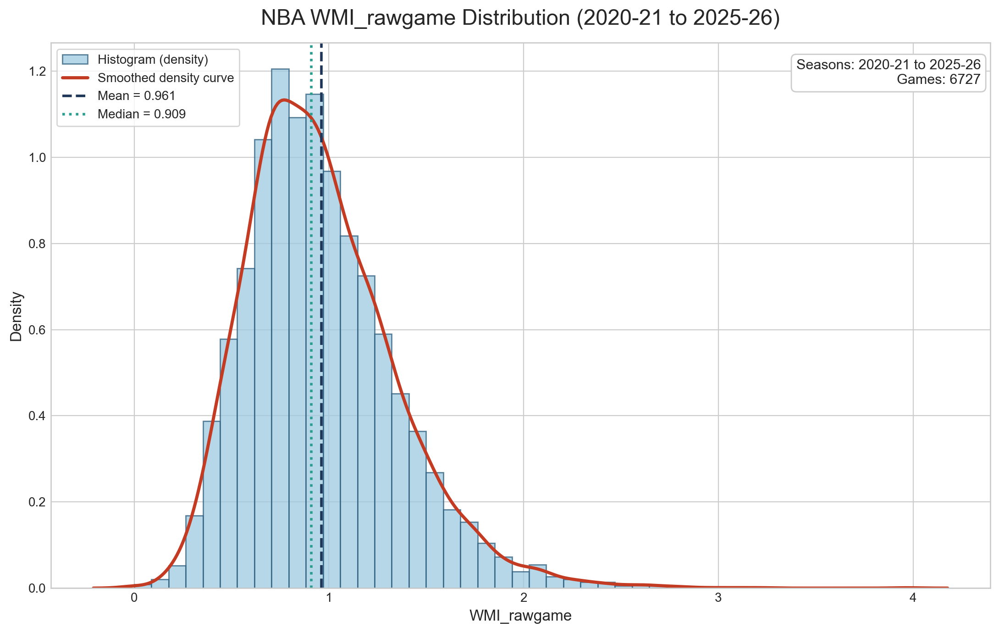

# NBA Whistle Momentum Index

NBA Whistle Momentum Index is a possession-level basketball analytics project that asks a simple question:

> After recent defensive foul calls, do NBA games show short-term changes in foul-call momentum?

The current public version is intentionally narrow. It uses one active metric, `WMI_game`, calculated game by game.



## What WMI Measures

`WMI_game` compares whistle momentum after recent defensive fouls to whistle momentum without recent defensive fouls.

Core variables:

- `L_t`: equals `1` if at least one of the previous two possessions had a counted defensive foul.
- `F_t`: equals `1` if the current possession had a counted defensive foul.
- `N_t`: equals `1` if at least one of the next two possessions had a counted defensive foul.
- `M_t`: possession momentum score, defined as `F_t + F_t*N_t`.

Formula:

```text
WMI_game =
average(M_t where L_t = 1) / average(M_t where L_t = 0)
```

Interpretation:

- `WMI_game > 1`: more whistle momentum after recent fouls.
- `WMI_game ~= 1`: little or no difference.
- `WMI_game < 1`: less whistle momentum after recent fouls.

WMI is a pattern metric. It is not proof of referee intent, bias, or misconduct.

## Current Results

The active comparison dataset covers 2020-21 through the available 2025-26 snapshot.

- Games with WMI: `6,727`
- Mean `WMI_game`: `0.960619`
- Median `WMI_game`: `0.909180`
- Percentiles are stored as `wmi_game_percentile`

Main outputs:

- `wmi_games_2020_21_to_2025_26.csv`
- `wmi_distribution_2020_21_to_2025_26_summary.csv`
- `wmi_distribution_2020_21_to_2025_26_failures.csv`
- `wmi_game_distribution_2020_21_to_2025_26.png`

## Quick Start

Install dependencies:

```bash
python -m pip install -r requirements.txt
```

Run checks:

```bash
ruff check .
pytest -q
```

Calculate one game:

```bash
python calculate_wmi_game_any_game.py --game-id 0022500802
```

Build a smoke-test distribution:

```bash
python build_wmi_distribution_2020_2026.py --max-games-per-season 2
```

Plot the 2025-26 snapshot:

```bash
python plot_wmi_game_distribution_2025_26.py
```

## Project Structure

- `wmi_game_utils.py`: shared possession parsing and WMI calculation logic.
- `calculate_wmi_game_any_game.py`: one-game WMI runner.
- `calculate_wmi_games_2025_26.py`: 2025-26 completed-game runner.
- `build_wmi_distribution_2020_2026.py`: multi-season WMI distribution builder.
- `tests/`: active test suite.
- `PROJECT/`: formal definitions, project guide, and project history.
- `archive/controlled_experiments/`: paused controlled-WMI experiments, kept only as research history.

## Data Notes

The project uses publicly available NBA play-by-play data endpoints. Some game IDs are unavailable or incomplete through those endpoints; failures are logged explicitly in `wmi_distribution_2020_21_to_2025_26_failures.csv`.

The active product is game-by-game WMI. Completed-game lists are comparison context for percentiles and distribution plots, not a separate pooled season edition.

## Status

This is a v1 research release. The metric is intentionally simple, explainable, and scoped to completed games.
