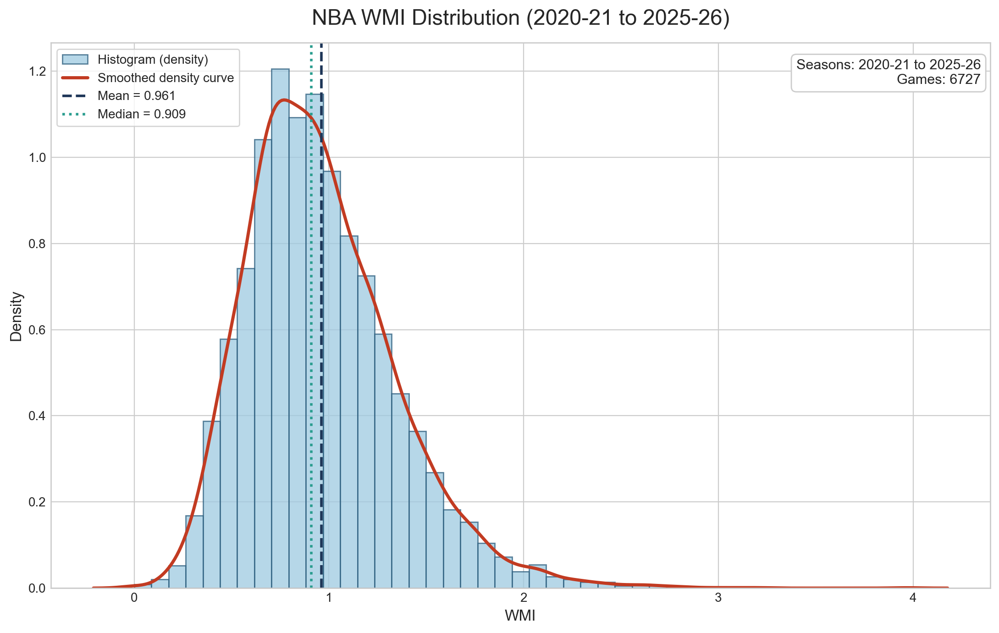

# NBA Whistle Momentum Index

NBA Whistle Momentum Index is a possession-level basketball analytics project that asks a simple question:

> After recent defensive foul calls, do NBA games show short-term changes in foul-call momentum?

The public headline metric is `WMI`, calculated game by game. A separate validation study audits possession reconstruction and tests whether recent foul history improves prediction beyond basketball context.



## What WMI Measures

`WMI` compares whistle momentum after recent defensive fouls to whistle momentum without recent defensive fouls.

Core variables:

- `L_t`: equals `1` if at least one of the previous two possessions had a counted defensive foul.
- `F_t`: equals `1` if the current possession had a counted defensive foul.
- `N_t`: equals `1` if at least one of the next two possessions had a counted defensive foul.
- `M_t`: possession momentum score, defined as `F_t + F_t*N_t`.

Formula:

```text
WMI =
average(M_t where L_t = 1) / average(M_t where L_t = 0)
```

Interpretation:

- `WMI > 1`: more whistle momentum after recent fouls.
- `WMI ~= 1`: a small observed ratio difference; statistical equivalence is not established.
- `WMI < 1`: less whistle momentum after recent fouls.

WMI is a pattern metric. It is not proof of referee intent, bias, or misconduct.

## Current Results

The active comparison dataset covers 2020-21 through the available 2025-26 snapshot.

- Games with WMI: `6,727`
- Mean `WMI`: `0.960619`
- Median `WMI`: `0.909180`
- Percentiles are stored as `wmi_percentile`

Main outputs:

- `wmi_games_2020_21_to_2025_26.csv`
- `wmi_search_games_2019_2026.csv`
- `wmi_search_games_2019_2026_failures.csv`
- `wmi_distribution_2020_21_to_2025_26_summary.csv`
- `wmi_distribution_2020_21_to_2025_26_failures.csv`
- `wmi_distribution_2020_21_to_2025_26.png`

## Quick Start

Install dependencies:

```bash
python -m pip install -r requirements.txt
```

Run checks:

```bash
ruff check .
pytest -q
```

Calculate one game:

```bash
python calculate_wmi_any_game.py --game-id 0022500802
```

Build a smoke-test distribution:

```bash
python build_wmi_distribution_2020_2026.py --max-games-per-season 2
```

Plot the 2025-26 snapshot:

```bash
python plot_wmi_distribution_2025_26.py
```

Build the website search dataset:

```bash
python build_wmi_search_dataset.py
```

## MVP Website

The static MVP website is in `index.html` and `styles.css`. It is designed to run directly from the repository root and can be served by GitHub Pages.

Preview locally:

```bash
python -m http.server 8000
```

## Project Structure

- `wmi_utils.py`: shared possession parsing and WMI calculation logic.
- `calculate_wmi_any_game.py`: one-game WMI runner.
- `calculate_wmi_games_2025_26.py`: 2025-26 completed-game runner.
- `build_wmi_distribution_2020_2026.py`: multi-season WMI distribution builder.
- `build_wmi_search_dataset.py`: static website search dataset builder.
- `tests/`: active test suite.
- `index.html`, `styles.css`, and `site.js`: static MVP website.
- `PROJECT/`: formal definitions, project guide, and project history.
- `archive/controlled_experiments/`: paused controlled-WMI experiments, kept only as research history.

## Data Notes

The project uses publicly available NBA play-by-play data endpoints. Some game IDs are unavailable or incomplete through those endpoints; failures are logged explicitly in `wmi_distribution_2020_21_to_2025_26_failures.csv`.

The active product is game-by-game WMI. Completed-game lists are comparison context for percentiles and distribution plots, not a separate pooled season edition.

The website search dataset covers 2019-20 through the available 2025-26 snapshot, including regular season, playoffs, and play-in games where source play-by-play data is available. Unavailable source rows are logged in `wmi_search_games_2019_2026_failures.csv`.

## Status

This is a v1 research release. The metric is intentionally simple, explainable, and scoped to completed games.

## Audited validation release

The shared parser now splits at period changes, ignores administrative ownership changes when starting possessions, and reconstructs time without using future overtime. The WMI formula and global windows are unchanged. Existing CSV snapshots remain archived release data; `site-data/audited_games.csv` overlays recalculated games in search. Each row names its parser version and percentile reference cohort.

Run the reproducible offline study:

```bash
python validate_wmi.py
python forecast_foul_sequences.py
python validate_wmi_intervals.py
python -m pytest -q
node tests/test_site.cjs
```

The conditional sequence runner executes only when the replication gate passes. The main study needs the commit-pinned inputs listed in `research/hypotheses_2026_09_12/source_manifest.json`; the existing fetch helper acquires those inputs. It verifies SHA256 hashes before use. `python validate_wmi.py --evaluate-only` uses the saved possession partitions. Development builds require `--max-games N --output /tmp/wmi-smoke` so release artifacts are protected.

Outputs live in `research/validation_2026_09_12/`: protocol, report, source/partition manifest, environment versions, parser and source comparisons, held-out predictions, calibration, residuals, and the expansion decision. Compressed possession partitions include model inputs and separately named outcomes. Current-possession shots/free throws are never prediction features. Missing shot-zone coverage is explicit.

The August expansion report is historical; its prediction claims are superseded by the matched context/history validation. A coverage stress test of circular block intervals found inconsistent coverage, so per-game confidence intervals remain withheld. The website shows sample counts and denominator diagnostics without asserting significance.
